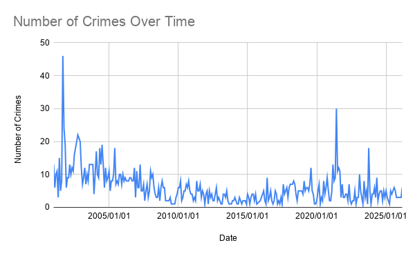
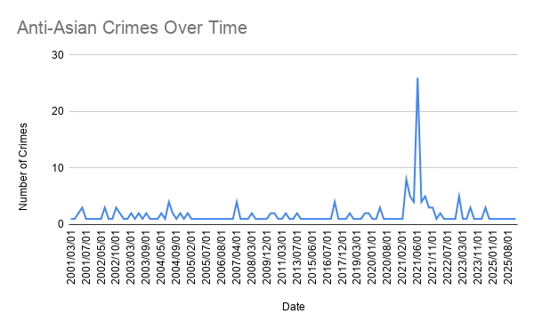
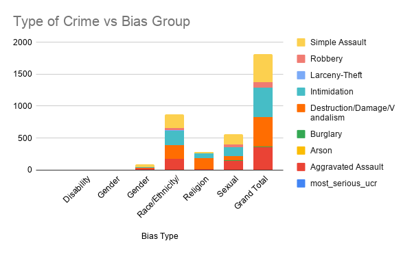

# J124-FINAL
# Hate Crimes Derived from World Events

This dataset “Police Investigated Hate Crimes” was published by DataSF, San Francisco’s data portal. This dataset contains 1813 recorded incidents between January 2001 and March 2026, generated by SFPD’s Hate Crimes Unit. These incidents are reviewed and determined if they fall under the legal definition of a hate crime under the California Penal Code which is how these hate crime statistics are recorded. DataSF is not the originator of this data, and these records do not reflect every bias motivated incident that ever occurs in San Francisco.

By the way this dataset is recorded, there is a few things to consider when looking at the bare numbers:
Every incident in this dataset requires a victim to notify authorities for police to begin investigation by a specialized unit to classify the incident as a hate crime, rather than just a “prejudice incident”. We also have to consider that a majority of hate crimes aren’t reported at all, so we can only take these statistics in context that these crimes don’t truly represent the true number of hate crimes committed. The amount of incidents reported in this dataset could reflect trust in SFPD, how safe they feel calling authorities versus taking matters into their own hands. There is also the question of how well officers distinguish bias motivation in classifying a true hate crime under the legal definition.
Given that, we know that SFPD is the originator and investigator of these numbers. Not to say that they aren’t a trustworthy source, but taking in other accounts or recordings of trends in hate crimes from the Department of Justice and other sources. There are 585 cases in which the suspect is listed as unknown, in which we cannot generalize any race to any hate crime. The last thing to consider is that this data only represents San Francisco, so we cannot use it to represent any national trends.

With all that in consideration, this systematic record of bias motivated violence is one of only those that is publicly available and the method of collection is defined clearly about the process of hate crime classification.

## 3. Data Analysis
[Police Investigated Hate Crimes](https://docs.google.com/spreadsheets/d/1yqWZmwcg6pR2QqN2WysP7xAxTRirqnBibexVdmTrn5U/edit?usp=sharing)
The link to my google sheets includes 4 different pivot tables in sheets labeled Figure 1, 1b, 2, 3.

Figure 1 shows the count of hate crimes over time over 24 years with a visualization. At a peak of 181 cases and a low of 22. I took visualization a step further to include Figure 1b that filters Anti-Asian incidents. Most of the incidents, 60 cases out of 114, in the year 2021 are accounted as Anti-Asian bias, when typically we see less than 10 Anti-Asian crimes in the years before and following, which highlights the era of COVID-19. Stories about Asian Americans facing discrimination were heard frequently, and this spike was shown to return back to baseline in 2022, showing a temporary social shift during a world-wide pandemic. Knowledge of the virus’s Chinese origin is clearly shown to have a negative impact here.

Figure 2 shows a breakdown of race, ethnicity, sexual orientation by type of hate crime. From our data, we see that 81% of sexual orientation-motivated incidents were violent and personally directed crimes, whereas religion-motivated incidents were more frequently property crimes such as vandalism, swastika graffiti, and religious gathering location damages. This pattern in type of crime versus bias groups makes us wonder how each type of incident gets reported or if the form of crime is motivated by the bias-type.

In figure 3, I highlight the proportion of the suspect race being unknown, 585 incidents out of 1813 which is 32%. White suspects account for the largest share of recorded incidents, 600 cases, followed by African American suspects with 384 cases. If we were to make a story on these numbers, people would need to know that 32% of suspect’s races were not recorded and we cannot generalize any crime or bias type against one group.

## 4. Visualization

## 5. Summary, Ethical Concerns
The only finding we can accurately infer from the data is how social and political events trigger spikes in reported hate crimes, for example Anti-Asian hate during the pandemic and even Anti-Muslim bias following the national terrorist attack on 9/11. In 2021, the increase of total hate crimes were clearly driven by a single category of bias-type being Anti-Asian, tied to a specific world event or news report that eventually receded in time. This shows us how hate crime trends are reflective of major world events that could promote a specific bias against a certain group of individuals and that the data isn’t just random.

Ethical concerns that could arise from building a story on this data have to consider:
Stereotyping or generalizing against suspect data would show how White and African Americans are the leading suspects of committing hate crimes. By just showing raw counts, we imply that certain groups are disproportionately responsible for these amounts of hate crimes in San Francisco, when the data is largely incomplete with unknown suspects. We have to emphasize that this data is not a census of every hate crime that occurred, but only those that were reported, investigated, and classified as a hate crime.

Because incident counts can spike around a single news event like during the pandemic, publishing a story about the data during that time could be used to weaponize against suspects or victims depending on the narrative shared. The whole picture must be shared with context and influencing factors, rather than just showing dramatic changes in year to year comparisons. 

We also have to consider the barriers to contacting police, and how a story that highlights underreporting from specific groups could discourage victims from even coming forward.

Additional reporting would need to be done, such as interviewing SFPD’s Hate Crimes Unit to learn more about their classification process and staffing capacity could provide much more context to the number of recorded incidents. Furthermore, we could check these trends against the DOJ’s statewide hate crime data, or even individual organizations that collect self-reported incidents that are not checked through SFPD. We also need direct interviews from victims themselves to get real accounts and stories that show the perspective through a human, rather than inferring from raw data. The biggest gap in this dataset is how we’ll never know what never gets reported and what doesn’t make it through the hate crime classification. These crimes that aren’t recorded are just as strong as the data and trends recorded, so a story would emphasize that clearly as much as it claims anything else.
